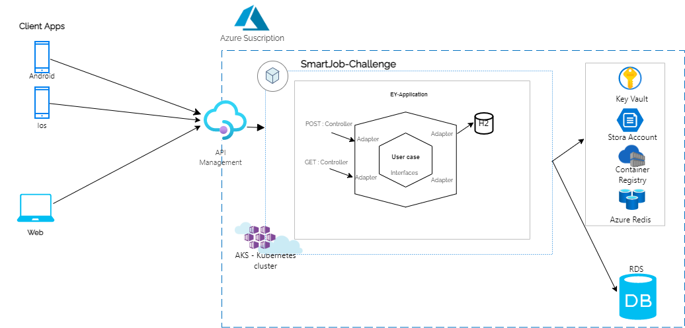

# SmartJob-Challenge

# README #

# 1 Informacion del proyecto #
Proyecto: Resto tecnico de EY, enviado por SmartJob
Versiones de librerias usadas en el proyecto:

Versiones de librerias:
    * Org.springframework.boot: 2.5.67
    * Io.spring.dependency-management 1.0.11.RELEASE
    * Springdoc-openapi-ui : 1.5.2
    * Io.jsonwebtoken 0.9.1

# 2 Manual de despliegue

Aqui encontraras los pasos principales para encontrar 

###  2.1 Sofware necesarios

* Tener instalado Java JDK 11 
* Tener installado Gradle 3.6.0+ 

### 2 Como desplegar la aplicacion

Descargar y ejecutar el siguiente programa usando IntelliJ IDEA: https://github.com/abelhuarca/SmartJob-challenge

### 4 Urls del Swagger y consola del H2

Swagger: Para poder ver la documentacion de los endpoint, por favor seguir los siguientes pasos:
* A. Entrar a la siguiente  ruta: http://localhost:8096/swagger-ui/index.html
* B. Dentro del buscador ingresar /api-docs (aqui podar ver los http Method que tiene el MS).

H2: Para poder ver la consola de la base de datos en memoria por favor seguir los siguientes pasos:
* A. Entrar a la siguiente  ruta: http://localhost:8096/h2-console
* B. Remplazar el contenido del campo JDBC URL, por la Url configurado en el aplication properties en la la parte de datasource(jdbc:h2:mem:mydb)
* B. Ingresar a la consola, dando clic a "Connect*

### 5 Arquitectura  de componentes 
Esta arquitecura es referencial, es como yo confidero que deberia ser la arquitectura en un escenari productivo
tomando las siguientes premisas:

* A. El proveedor de nuve con el que trabaja la empresa es Azure
* B. El MS solo expone una capacidad asincrona, por lo cual no es necesario considerar una tecnologia de colas.

La arquitectura en formato PNG se encuentra en la siguiente Ruta: docs/architecture/EY-SmartJob-Solution.png

### 6 Notas:
* A. El archivo postman lo podemos para probar los endpoint lo podemos encontrar en : resource/json-example
* B. El MS ha sido creado usando arquitectura exagonal para mayor detalle por favor revisar: https://platzi.com/blog/arquitectura-hexagonal/